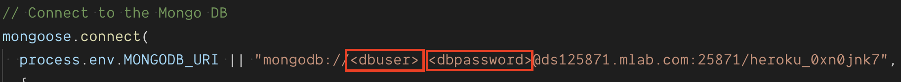
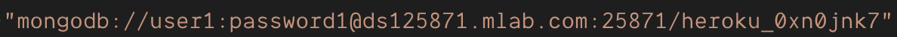
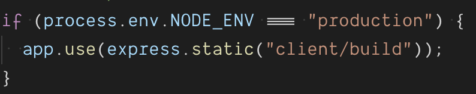
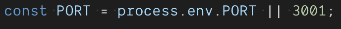

# Deploy your MERN Application to Heroku

This guide will take you through the process of deploying a full MERN Stack application to Heroku. We could normally host our standard React applications on GitHub Pages, but now that we have MySQL or MongoDB, Node, Express AND React we will need to utilize Heroku for hosting our application.

**Note**: Please ensure your app functions properly locally with no errors. Fix any errors that are occurring or you can expect your application to not deploy.

We have also created a video guide that you can use along with this guide to help you through the process.
[MERN to Heroku](https://www.youtube.com/watch?v=qXIG8iKO7Fo&feature=youtu.be&list=PLOFmg4xbN_TPrB6w4rThsFanVxJI_SfER)

* Many of the steps associated with this guide are similar to other deployment guides you were previously provided, so those steps will not be covered. If you need these again, check your class repository!

1. The first thing you will need is a GitHub Repository. When creating this repository be sure to create it with a Node `.gitignore` file. This is so we can ignore our `node_modules` folder since we don't want that being tracked by git.

2. Now that we have created a repository, go to [Heroku](https://www.heroku.com) and login to your account. Create a new app and follow the steps from our GitHub Heroku Connect guide to link your GitHub Repo to your Heroku app.

* Be sure to `Enable Automatic Deployments` after linking your Repo with your Heroku App.

3. Now that your repo and Heroku app are connected, provision the proper add-on for the database you will be using. `JawsDB` for MySQL or `mLab` for MongoDB.

* For the purposes of this guide, we will be using mLab and MongoDB.

4. Now that we have provisioned `mLab`, enter the `mLab` dashboard and create a new user like we did in our MongoDB Deployment Guide.

5. Now that we have created a new user, all we need to do is enter our connection information into our `server.js` file of our MERN application.

6. First, lets enter in our `mLab` database information into our `server.js` for use with localhost.

7. We now need to replace `<dbuser>` and `<dbpassword>` with our created username and password we created on the `mLab` dashboard.

* We will remove the `<>` surrounding our user and password.

8. Now that this is done, we want to be sure to use our `client/build` folder when running on production. You will need this line of code in your `server.js`.

9. Since the `client/build` folder is a static folder that has to be generated, make sure to run `yarn build` before pushing to GitHub/Heroku if you've made changes to the `client` folder in your app.

10. Finally you need to make sure that your `PORT` variable is set to use either the port heroku designates, or a port of your choosing.

